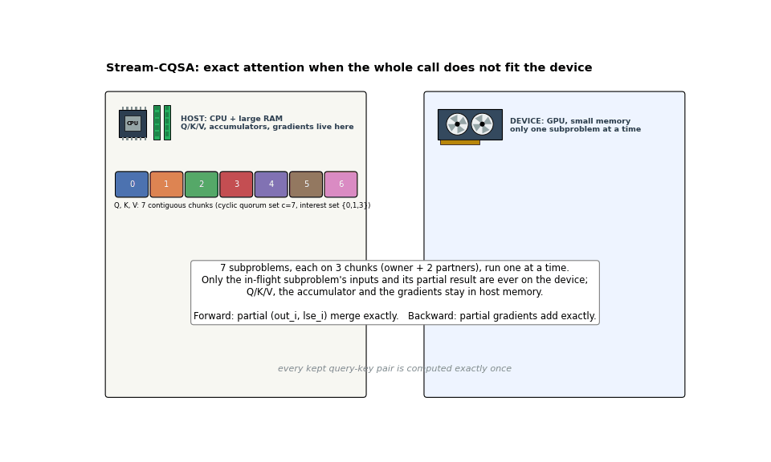

# Stream-CQSA v2

Exact out-of-memory recovery for attention. When an attention call does not fit
in device memory, Stream-CQSA decomposes its pair set over a cyclic quorum set
into independent subproblems, runs them one at a time (or a few at a time, or
on several devices), and recomposes the exact result. It defines no attention
rule of its own: it reproduces whatever kernel it wraps.

Paper (v1): [arXiv:2604.20819](https://arxiv.org/abs/2604.20819) ·
v1 repo: [yiming-b/Stream-CQSA](https://github.com/yiming-b/Stream-CQSA)

## How it works



Q/K/V live in host memory in 7 chunks. Each of the 7 subproblems gathers 3 chunks
(its owner chunk and two quorum partners) to the device, runs the CQS kernel on
them, and hands back a partial result: `(out_i, lse_i)` in the forward, which are
merged into a host accumulator with the same max-shifted arithmetic FlashAttention
uses inside one kernel; `(dq_i, dk_i, dv_i)` in the backward, computed against
the *global* log-sum-exp and scatter-added into host gradient buffers. Only one
subproblem's inputs and partial result are on the device at a time, and every
kept query–key pair is counted exactly once, so the result is exact.

## What is new in v2

| area | v2 |
|---|---|
| **native kernel** | second-generation forward kernel: 19% faster than v1 on the real workload (L=131K causal, A100), and with CQS off it now equals FlashAttention-2 (`docs/kernel_technical_note.md`) |
| **engine** | pipelined host accumulator (d2h + merge overlap the next kernel), contiguous-chunk DMA (`shared_chunks`), measured concurrency policy; 1.44–1.86x faster end to end than v1 on one A100 |
| **multi-device** | `stream_cqsa.distributed`: exact sharding of the subproblems over a `torch.distributed` group; 3.2–3.5x on 4 GPUs, 5.1x on 8 GPUs / 2 nodes |
| **automatic configuration** | `stream_cqsa.autoconfig`: monolithic vs decomposed, depth `itr`, quorum set `(c, interest_set)`, accumulator placement, host residency, concurrency and device count chosen from a hardware description and a calibratable cost model |
| **independent fwd/bwd** | the backward plans its own decomposition depth (`bwd_itr="auto"`) |
| **developer kit** | `stream_cqsa.devkit`: plug any inner kernel into the framework and get exactness (bit-identical / within rounding / not) and performance against its monolithic call; `quick_bench` sweeps |
| **Triton kernels (no build)** | `stream_cqsa.triton_kernel`: forward AND backward CQS kernels in Triton with the CUDA kernels' contract, selected automatically when no extension is compiled (`CQSA_BACKWARD=triton` forces the backward). Forward: 0.75–0.91x the CUDA kernel at L=56K (faster), within 13% at 899K; non-causal it beats FlashAttention-2 itself on the same L. Backward: 0.77x the CUDA CQS backward at L=56K, engine backward at 1M 29 s vs 39 s. Engine forward at 1M: 1.15x the CUDA path (`docs/LOG.md`, Phase 4) |
| **adapters** | `stream_cqsa.adapters`: automatic conversion of FlexAttention-expressible kernels (ALiBi, windows, soft-cap, document masks) into inner kernels, with global-position remapping |

## Install

The package runs with **no compilation**: the CQS forward and backward kernels are
also implemented in Triton (shipped with PyTorch), and the engine uses them
whenever the CUDA extension is absent.

```bash
pip install torch --index-url https://download.pytorch.org/whl/cu130   # match your CUDA
git clone https://github.com/yiming-b/Stream-CQSA-v2.git && cd Stream-CQSA-v2
pip install -e . --no-build-isolation --no-deps --config-settings=--build-option=--skip-ext 2>/dev/null \
  || PYTHONPATH=$PWD python -c "import stream_cqsa"                       # or just put the checkout on PYTHONPATH
pip install flash-attn                                                  # optional: the monolithic fast path
```

That is enough for everything in this README. The Triton kernels are as fast as
or faster than the CUDA ones for subproblems up to ~100K tokens and within
10–15% beyond (forward); the Triton backward is the fastest one in the package.
Triton compiles each kernel configuration on first use (a few seconds, cached).

**Optional CUDA extension** (buys 10–15% on the forward at 1M tokens and up;
40–75 min of nvcc on 8 cores):

```bash
pip install ninja
CQSA_KERNEL_SET=common pip install -e . --no-build-isolation             # fp16+bf16, head dims 64/128, sm80
```

`setup.py` builds two extensions, `cqsa_cuda` (from `csrc/`, the v11 forward,
causal calls) and `cqsa_cuda_nc` (from `csrc_nc/`, the v9 forward, non-causal
calls; v11's non-causal instantiation is mis-compiled by ptxas, see the
technical note). Environment switches: `CQSA_FORWARD=triton` /
`CQSA_BACKWARD=triton` force the Triton kernels even when the extension is
present; `CQSA_CUDA_MODULE` / `CQSA_CUDA_MODULE_NONCAUSAL` pick extension
modules by name.

## Use

```python
import torch
from stream_cqsa import attention_oom_safe, stream_cqsa_attn, auto_attention

q, k, v = (torch.randn(1, 8, 4_000_000, 64, dtype=torch.float16) for _ in range(3))   # host or device

out = attention_oom_safe(q, k, v, causal=True)            # SDPA first; Stream-CQSA only on OOM
out = stream_cqsa_attn(q, k, v, causal=True)              # autograd; backward plans its own depth
out, plan = auto_attention(q, k, v, causal=True,          # plan from a hardware budget, then run
                           hardware={"cuda:0": "40GiB", "host": "256GiB"})
```

Explicit control: `stream_cqsa_forward(q, k, v, itr=, c=, interest_set=, low_memory=,
stream_from_host=, max_parallel=, shared_chunks=)` and `stream_cqsa_backward(...,
itr="auto")`. Planner: `plan(N, B, H, D, dtype, causal, hardware, direction="fwd"|"bwd")`,
`calibrate()`, `autotune()`. Devkit: `compare_kernels(inner_fn, mono_fn)`,
`quick_bench()`. Adapters: `flex_inner(score_mod, extra_mask_mod)`. Multi-device:
`distributed.dist_stream_cqsa_forward/_backward` under `torch.distributed`.

Notebooks (executed, outputs included): `notebooks/stream_cqsa_v2_demo.ipynb` runs every
feature on one GPU; `notebooks/oom_boundary_demo.ipynb` sweeps N explicitly under a memory cap
and shows the baseline matching Stream-CQSA below the boundary and OOM-ing above it while
Stream-CQSA continues, exact.

## Layout

    stream_cqsa/      the package (engine, planner, devkit, adapters, distributed, autograd)
    csrc/, csrc_nc/   the two kernel source trees (FlashAttention-2 + CQS; v11 and v9)
    tests/            pytest suite (engine, planner, devkit, adapters)
    benchmarks/       kernel A/B, pipeline A/B, end-to-end, quick bench, ncu driver, quorum axis
    distributed/      multi-device tests (2/4/8 GPUs)
    slurm/            job templates, incl. slurm/paper/ (the paper's experiments re-run with v2)
    notebooks/        the demo notebook and its generator
    docs/             kernel technical note, design notes (kernel suite / automatic conversion),
                      the full engineering log (LOG.md), per-step kernel diffs
    results/          every measurement referenced in the docs (JSON + slurm logs)

## Headline measurements (A100-SXM4-80GB, fp16, B=1 H=8 D=64, causal)

| N | FlashAttention-2 (device-resident) | Stream-CQSA v1 | Stream-CQSA v2 | v2 / v1 |
|---|---|---|---|---|
| 256K | 0.36 s | 2.17 s | 1.17 s | 1.86x |
| 1M | 5.96 s | 15.51 s | 9.49 s | 1.63x |
| 2M | 24.18 s | 50.97 s | 35.31 s | 1.44x |

Both Stream-CQSA arms stream Q/K/V from host memory with a host accumulator (the
recovery configuration); outputs are identical to v1 and, against float64, more
accurate than the monolithic fp16 call (2.8e-4 vs 5.5e-4 at 1M). Kernel alone on
the real subproblem: 30.2 → 24.4 ms (FA-2: 17.5 ms). Details and every other
number: `docs/LOG.md`, `results/`.

## License

BSD-3-Clause (see `LICENSE`); vendored FlashAttention-2 and CUTLASS notices in `third_party/`.
