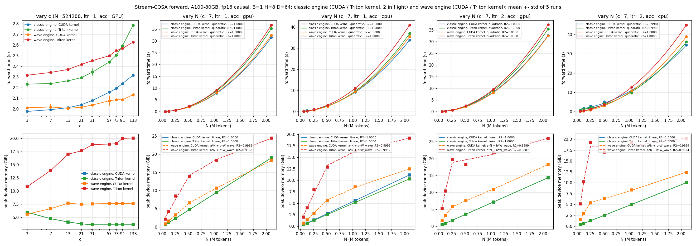

# Stream-CQSA v2

Exact out-of-memory recovery for attention. When an attention call does not fit
in device memory, Stream-CQSA decomposes its pair set over a cyclic quorum set
into independent subproblems, runs them one at a time (or a few at a time, or
on several devices), and recomposes the exact result. It defines no attention
rule of its own: it reproduces whatever kernel it wraps.

Paper (v1): [arXiv:2604.20819](https://arxiv.org/abs/2604.20819) ·
v1 repo: [yiming-b/Stream-CQSA](https://github.com/yiming-b/Stream-CQSA)

## How it works


Q/K/V live in host memory in 7 chunks. Each of the 7 subproblems gathers 3 chunks
(its owner chunk and two quorum partners) to the device, runs the CQS kernel on
them, and hands back a partial result: `(out_i, lse_i)` in the forward, which are
merged into a host accumulator with the same max-shifted arithmetic FlashAttention
uses inside one kernel; `(dq_i, dk_i, dv_i)` in the backward, computed against
the *global* log-sum-exp and scatter-added into host gradient buffers. Only one
subproblem's inputs and partial result are on the device at a time, and every
kept query–key pair is counted exactly once, so the result is exact.

## What is new in v2

| area | v2 |
|---|---|
| **native kernel** | second-generation forward kernel: 19% faster than v1 on the real workload (L=131K causal, A100), and with CQS off it now equals FlashAttention-2 (`docs/kernel_technical_note.md`) |
| **engine** | pipelined host accumulator (d2h + merge overlap the next kernel), contiguous-chunk DMA (`shared_chunks`), measured concurrency policy; 1.44–1.86x faster end to end than v1 on one A100 |
| **multi-device** | `stream_cqsa.distributed`: exact sharding of the subproblems over a `torch.distributed` group; 3.2–3.5x on 4 GPUs, 5.1x on 8 GPUs / 2 nodes |
| **automatic configuration** | `stream_cqsa.autoconfig`: monolithic vs decomposed, depth `itr`, quorum set `(c, interest_set)`, accumulator placement, host residency, concurrency and device count chosen from a hardware description and a calibratable cost model |
| **independent fwd/bwd** | the backward plans its own decomposition depth (`bwd_itr="auto"`) |
| **developer kit** | `stream_cqsa.devkit`: plug any inner kernel into the framework and get exactness (bit-identical / within rounding / not) and performance against its monolithic call; `quick_bench` sweeps |
| **Triton kernels (no build)** | `stream_cqsa.triton_kernel`: forward AND backward CQS kernels in Triton with the CUDA kernels' contract, selected automatically when no extension is compiled (`CQSA_BACKWARD=triton` forces the backward). Forward: 0.75–0.91x the CUDA kernel at L=56K (faster), within 13% at 899K; non-causal it beats FlashAttention-2 itself on the same L. Backward: 0.77x the CUDA CQS backward at L=56K, engine backward at 1M 29 s vs 39 s. Engine forward at 1M: 1.15x the CUDA path (`docs/LOG.md`, Phase 4) |
| **native wave kernel** (`native/`, `stream_cqsa.native_wave`) | a CQS kernel that runs *several subproblems per launch*: the wave is one batched launch with per-subproblem group bits, tile summaries and a block map that reads the original Q/K/V in place (no gather); one deterministic merge kernel recomposes the wave. 9-30% faster than the stream-based engine at N=131K (more subproblems, more gain), bit-identical to the v11 kernel per subproblem; forward + backward (`docs/LOG.md`, Phase 6) |
| **adapters** | `stream_cqsa.adapters`: automatic conversion of FlexAttention-expressible kernels (ALiBi, windows, soft-cap, document masks) into inner kernels, with global-position remapping |

## Install

Two implementations of the kernels ship, and where you get them differs:

| | kernels | where | install |
|---|---|---|---|
| **Triton build** | CQS forward and backward in Triton, compiled on your machine for your GPU; no compiler, no torch/CUDA matching | PyPI | `pip install stream-cqsa` |
| **CUDA build** | the classic CUDA extensions (FlashAttention-2-derived CQS forward, CUDA backward) plus the native wave kernel; the fastest forward | GitHub release page (prebuilt wheels per python / torch / CUDA / GPU) or a source build | see below |

The package picks at run time: CUDA extensions and the wave kernel when they are importable,
Triton otherwise. `stream-cqsa-doctor` shows which kernels loaded. Since v2.2.0 the wave engine
also runs on the Triton kernel (`attention(..., kernel="wave-triton")`; `"wave-cuda"` pins the
CUDA one), supports the host accumulator (`accumulate_on_gpu=False`) on both, and the quorum-set
register includes c=3 and c=133; the automatic planner enumerates every registered set. The Triton backward is the
default in both builds (it measured faster than the CUDA backward at every length);
`CQSA_BACKWARD=cuda` selects the CUDA backward.

### Triton build (PyPI)

```bash
pip install torch --index-url https://download.pytorch.org/whl/cu126     # match your CUDA
pip install stream-cqsa                                                  # Triton kernels, no compilation
python -m stream_cqsa.doctor                                             # what this machine can run, and how far
```

`pip install triton` if your torch did not bring it. `pip install flash-attn` is optional and
gives the monolithic fast path its own kernel. The same build installs from a checkout without
compiling: `CQSA_SKIP_EXT=1 pip install --no-build-isolation git+https://github.com/yiming-b/Stream-CQSA-v2.git`.

### CUDA build (GitHub release page)

The [release page](https://github.com/yiming-b/Stream-CQSA-v2/releases/tag/v2.2.0) carries, for
every python 3.10/3.11/3.12 x torch 2.5.1/2.6.0 x CUDA 12.4 x GPU architecture (sm80 = A100 and
other 8.x cards, sm90 = H100) cell, two wheels: `stream_cqsa` with the classic CUDA extensions and
the companion `stream_cqsa_native` with the wave kernel. Install both; they replace the PyPI
package with the same version plus the extensions:

```bash
V=v2.2.0; T=1cu124torch2.6sm80; PY=cp311     # pick your torch / CUDA / GPU / python
pip install https://github.com/yiming-b/Stream-CQSA-v2/releases/download/$V/stream_cqsa-2.2.0-$T-$PY-$PY-linux_x86_64.whl
pip install https://github.com/yiming-b/Stream-CQSA-v2/releases/download/$V/stream_cqsa_native-2.2.0-$T-$PY-$PY-linux_x86_64.whl
```

Also on the release page: one wheel with both extensions for torch 2.10 / CUDA 13 / python 3.11
(`stream_cqsa-2.2.0-1cu130torch210sm8090-...whl`, sm80 + sm90), and the pure wheel and sdist that
PyPI serves. The CUDA wheels are too large for PyPI (100 MB per file), which is why they live on
GitHub, as PyTorch's own CUDA wheels do. They are built by `.github/workflows/wheels.yml` on every
tag; publishing to PyPI is the `pypi` job, enabled by the repository variable `PYPI_PUBLISH=true`
with trusted publishing.

From source, for any GPU: `pip install -e . --no-build-isolation` in a checkout compiles the
classic extensions for the card present (40-75 min of nvcc; `CQSA_KERNEL_SET=common` covers
fp16/bf16 and head dims 64/128); `CQSA_BUILD_NATIVE=1` adds the wave kernel.

## Use

```python
import torch, stream_cqsa

q, k, v = (torch.randn(1, 8, 4_000_000, 64, dtype=torch.float16) for _ in range(3))   # host or device
out = stream_cqsa.attention(q, k, v, is_causal=True)          # SDPA's signature; exact, always fits
```

That is the whole API for most uses. Below the memory boundary the call *is* the
monolithic kernel; above it the planner chooses the decomposition from the free memory
and the call runs exactly, on the best kernel available. Gradients flow when the inputs
require them. To route an existing model without touching it:

```python
stream_cqsa.patch_sdpa()          # F.scaled_dot_product_attention now falls back to Stream-CQSA above 64K tokens
with stream_cqsa.patched_sdpa():  # or scoped
    model(...)
```

Seeing what it does, and what it would cost:

```python
out = stream_cqsa.attention(q, k, v, is_causal=True, verbose=True)   # or CQSA_VERBOSE=1
#  Stream-CQSA: forward of N=4.0M tokens ... decomposed over c=31 at depth itr=1: 31 subproblems on cuda:0 | ... | expected ~2m10s
#  Stream-CQSA: 100%|██████████| 31/31 [02:05<00:00,  4.05s/subproblem]
#  Stream-CQSA: done in 2m06s (31 subproblems)
stream_cqsa.estimate(16_777_216, H=8, D=64)     # dry run: monolithic fits?, chosen configuration, device/host memory, time
stream_cqsa.calibrate()                         # ~1 min once per GPU model; saved to ~/.cache/stream_cqsa and used from then on
```

Explicit control (all optional keyword overrides of `attention`, or the functions
themselves): `stream_cqsa_forward(q, k, v, itr=, c=, interest_set=, low_memory=,
stream_from_host=, max_parallel=, verbose=)`, `stream_cqsa_backward(..., itr="auto")`,
`stream_cqsa_attn` (autograd), `native_wave.wave_forward/wave_attention` (the wave kernel),
`plan(...)`, `autotune(...)`, `devkit.compare_kernels(inner_fn, mono_fn)`,
`adapters.flex_inner(score_mod, extra_mask_mod)`, `distributed.dist_stream_cqsa_forward/_backward`
under `torch.distributed`. `attention(..., kernel="wave"|"cuda"|"triton")` pins the kernel.

`sbatch slurm/quickstart.slurm` runs all of the above on one GPU (`benchmarks/quickstart.py`;
output in `results/quickstart/`): the dry run, the monolithic path, the decomposed path under
a memory cap with progress, host-resident inputs, autograd, and a patched module.

Notebooks (executed, outputs included): `notebooks/stream_cqsa_v2_demo.ipynb` runs every
feature on one GPU; `notebooks/oom_boundary_demo.ipynb` sweeps N explicitly under a memory cap
and shows the baseline matching Stream-CQSA below the boundary and OOM-ing above it while
Stream-CQSA continues, exact.

## Layout

    stream_cqsa/      the package (engine, planner, devkit, adapters, distributed, autograd)
    csrc/, csrc_nc/   the two kernel source trees (FlashAttention-2 + CQS; v11 and v9)
    native/           the multi-subproblem "wave" kernel (cqsa_native): sources, build, tests, benchmark
    benchmarks/profile_sweep.py   one-parameter profiles (c; N x {itr, acc}) with quadratic/linear fits: results/profile_sweep/
    tests/            pytest suite (engine, planner, devkit, adapters)
    benchmarks/       kernel A/B, pipeline A/B, end-to-end, quick bench, ncu driver, quorum axis
    distributed/      multi-device tests (2/4/8 GPUs)
    slurm/            job templates, incl. slurm/paper/ (the paper's experiments re-run with v2)
    notebooks/        the demo notebook and its generator
    docs/             kernel technical note, design notes (kernel suite / automatic conversion),
                      the full engineering log (LOG.md), per-step kernel diffs
    results/          every measurement referenced in the docs (JSON + slurm logs)

## Headline measurements (A100-SXM4-80GB, fp16, B=1 H=8 D=64, causal)

| N | FlashAttention-2 (device-resident) | Stream-CQSA v1 | Stream-CQSA v2 | v2 / v1 |
|---|---|---|---|---|
| 256K | 0.36 s | 2.17 s | 1.17 s | 1.86x |
| 1M | 5.96 s | 15.51 s | 9.49 s | 1.63x |
| 2M | 24.18 s | 50.97 s | 35.31 s | 1.44x |

Both Stream-CQSA arms stream Q/K/V from host memory with a host accumulator (the
recovery configuration); outputs are identical to v1 and, against float64, more
accurate than the monolithic fp16 call (2.8e-4 vs 5.5e-4 at 1M). Kernel alone on
the real subproblem: 30.2 → 24.4 ms (FA-2: 17.5 ms). Details and every other
number: `docs/LOG.md`, `results/`.

### One parameter at a time (`results/profile_sweep/`, forward, device-resident Q/K/V, A100-SXM4-80GB)

Four kernel paths measured on one GPU (della-l09g5) in one session, 5 runs per point after a
warm-up, each configuration in its own process: the classic engine (one subproblem per launch, two
in flight) on the CUDA and on the Triton kernel, and the wave engine (several subproblems per launch)
on the CUDA and on the Triton kernel.

Vary c at N=512K, itr=1, acc=GPU (time in s / peak device memory in GiB):

| c | 3 | 7 | 13 | 21 | 31 | 57 | 73 | 91 | 133 |
|---|---|---|---|---|---|---|---|---|---|
| classic, CUDA | 1.98 / 5.97 | 1.99 / 4.74 | 2.01 / 4.12 | 2.04 / 3.76 | 2.08 / 3.58 | 2.16 / 3.58 | 2.19 / 3.58 | 2.24 / 3.58 | 2.32 / 3.58 |
| classic, Triton | 2.23 / 5.97 | 2.24 / 4.74 | 2.26 / 4.12 | 2.29 / 3.76 | 2.35 / 3.58 | 2.44 / 3.58 | 2.50 / 3.58 | 2.59 / 3.58 | 2.79 / 3.58 |
| wave, CUDA | 2.01 / 5.61 | 2.02 / 6.64 | 2.00 / 7.68 | 2.02 / 7.48 | 2.04 / 7.56 | 2.08 / 7.61 | 2.09 / 7.64 | 2.08 / 7.64 | 2.13 / 7.67 |
| wave, Triton | 2.32 / 10.8 | 2.34 / 13.9 | 2.37 / 17.0 | 2.42 / 17.6 | 2.45 / 18.8 | 2.50 / 18.9 | 2.55 / 19.0 | 2.57 / 20.0 | 2.63 / 20.1 |

The classic engine pays per launch (17% from c=3 to c=133 on CUDA, 25% on Triton); the wave engine
is nearly flat (6% and 13%) and wins from c=21 up on CUDA and from c=91 on Triton. The classic
engine's memory falls with c to the floor of Q/K/V plus the fp32 output; the wave engine packs a
whole wave (up to 2M tokens) of partial outputs, so its peak is higher and set by the wave budget.

Vary N at c=7 (x = N / 1e6; quadratic fit of the time over 64K..2M, R² >= 0.998 throughout):

| series | classic, CUDA | classic, Triton | wave, CUDA | wave, Triton |
|---|---|---|---|---|
| itr=1, acc=GPU | 7.22x² − 0.15x + 0.06 | 8.05x² − 0.04x + 0.03 | 7.43x² − 0.13x + 0.03 | 8.40x² − 0.09x + 0.05 |
| itr=1, acc=CPU | 7.16x² + 1.02x + 0.25 | 8.13x² + 0.48x + 0.20 | 7.68x² + 0.86x + 0.00 | 8.65x² + 1.41x + 0.02 |
| itr=2, acc=GPU | 7.21x² + 0.40x + 0.06 | 7.89x² + 0.31x + 0.07 | 7.36x² + 0.03x + 0.05 | 8.26x² + 0.43x + 0.02 |
| itr=2, acc=CPU | 6.12x² + 3.09x + 1.10 | 7.58x² + 0.76x + 1.11 | 7.95x² + 1.92x − 0.11 | 8.91x² + 2.78x − 0.08 |

The quadratic coefficient is the kernel: Triton is 11-16% behind CUDA at this head dim (the known
ratio of Triton's FlashAttention-2 forward), and the wave engine is within 3-4% of the classic
engine on the same kernel. The linear and constant terms are the engine overheads: acc=CPU adds
about 1 s per M tokens; itr=2 adds the launches, which the wave engine removes (its itr=2, acc=GPU
linear term is 0.03 against 0.40). At 2M tokens with acc=CPU the classic engine is 5-7% faster
than the wave engine because its per-subproblem host transfers overlap with compute while the wave
engine merges each wave on the host synchronously; this is why `attention()` keeps the classic
engine for host-accumulator forwards. Peak device memory is linear in N for the classic engine
(9.0 GiB per M tokens at itr=1 acc=GPU, 5.3 at acc=CPU, 6.8 / 4.8 at itr=2). The wave engine's is
not: it holds a whole wave of packed partial outputs, and the wave is capped by a token budget (2M
packed tokens by default), so the fit is `peak = a*N + b*W_wave + c` with W_wave the largest wave the
planner forms: wave CUDA 6.98*N + 1.92*W (R² 0.9998; Q/K/V + fp32 output + accumulator per resident
token, one fp32 partial output per packed token), wave Triton 4.84*N + 7.79*W (R² 0.978; the wave is
gathered into packed fp16 Q/K/V copies as well). W_wave rises with N and with c until it hits the
budget (1.6M packed tokens at 512K, 1.8M from 1M on), which is the plateau in the plots. Within a
wave the subproblems run in one batched launch, so the GPU schedules all of them together; waves run
one after another.



Reproduce: `sbatch slurm/profile_sweep_<kernel>.slurm` for cuda / triton / wave_cuda / wave_triton
(one gpu-test job each, `--constraint="sxm&gpu80"` so that all four land on the same GPU model),
then `python benchmarks/profile_sweep.py fit --out results/profile_sweep`.

## License

BSD-3-Clause (see `LICENSE`); vendored FlashAttention-2 and CUTLASS notices in `third_party/`.
